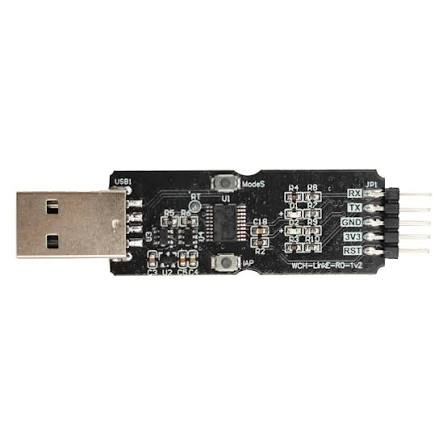

# InspireRV

Interactive LED matrix project based on **CH32V003F4P6** with **MounRiver Studio**.  
This project currently includes two main modes: **RV Paint** and **RV Code**.

## Platform

- MCU: CH32V003F4P6
- Toolchain: MounRiver Studio or riscv-none-elf-gcc-xpack in VS Code
    - For VS Code, it has 3 way to test the program in VS Code:
        -  `make all`: compile program system
        -  `make size`: runs riscv-none-elf-size build/app.elf, which reports code/data/BSS usage
        -  `make clean`: delete all compiled files so can rebuild whole project

- Features: RV Paint / RV Code

## Overview

This project uses an 8x8 RGB LED matrix with matching button input for interactive drawing and simple RISC-V-inspired visual coding.

Two working spaces are currently implemented:

- **Coding Space** for visual instruction entry and program execution.
- **Painting Space** for direct pixel-based drawing and color editing.

## 9 Buttons Options

### Coding Space

| Button | Function |
|---|---|
| 1 | Load |
| 2 | Brightness Control |
| 3 | Save, press 9 to reset after saved |
| 4 | Return to Programming Space |
| 5 | Result |
| 6 | Run Simulation |
| 7 | Clear |
| 8 | Clear Current Page |
| 9 | To Painting Space |

### Painting Space

| Button | Function |
|---|---|
| 1 | Load |
| 2 | Brightness Control |
| 3 | Save, press 9 to reset after saved |
| 4 | Color for Foreground |
| 5 | Nil |
| 6 | Color for Background |
| 7 | To Coding Space |
| 8 | Bucket Fill |
| 9 | Clear Screen |

## VS Code Lightweight Setup (if you don't want to download MounRiver Studio)
- **VS Code** for editing
- [Download 'RISC-V GCC toolchain'](https://github.com/openwch/risc-none-embed-gcc)
- Flash/debug tool, typically OpenOCD or [WCH-LinkUtility](https://www.wch.cn/downloads/WCH-LinkUtility_ZIP.html) (WCH-LinkUtility is **preferable** as it is the one mainly used in InspireLab)
- A compatible hardware probe such as WCH-LinkE

    

## Typical Flow (if use VS Code)
- Write *make all* in terminal → builds app.elf, app.bin, app.hex.
- Use a WCHLinkE-Utility flasher to write `build/app.bin` or `build/app.hex` to the chip.
- Check this to know further how to flash the program: https://www.youtube.com/watch?v=S3oZ3S9tHoU

## Notes

- Alex's Work:
    - Developed for CH32V003F4P6
    - Built with MounRiver Studio
    - Initial public version uploaded for version control and backup
- Adriel's Work (Summer Intern):
    - Developed for CH32V003F4P6
    - Built with VS Code
    - Before compiling, don't forget to **xpm init** to to create a package.json file for `riscv-none-elf-gcc-xpack`
        - Full installation guideline: https://xpack-dev-tools.github.io/riscv-none-elf-gcc-xpack/docs/install/ 
    

## Reference Used

- https://github.com/mtkos/ch32v003-minimal  
- https://github.com/openwch/risc-none-embed-gcc
- https://xpack-dev-tools.github.io/riscv-none-elf-gcc-xpack/docs/install/
- https://www.youtube.com/watch?v=S3oZ3S9tHoU
